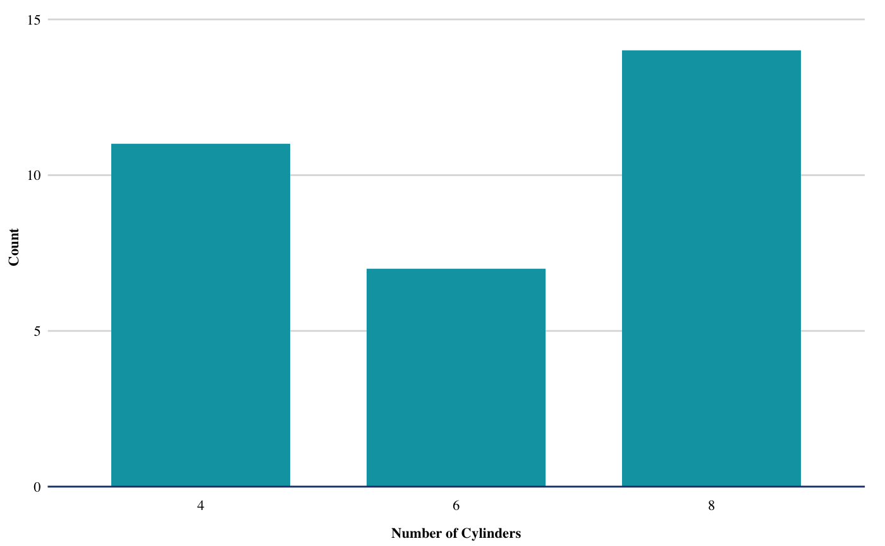

<!-- README.md is generated from README.Rmd. Please edit that file -->

# conethemes 

<!-- badges: start -->

[](https://travis-ci.org/medewitt/conethemes)
<!-- badges: end -->

The goal of conethemes is to …

## Installation

You can install the released version of conethemes from
[CRAN](https://CRAN.R-project.org) with:

``` r
# NOT YET
install.packages("conethemes")
```

Or the development version at :

``` r

remotes::install_github("medewitt/conethemes")
```

This package borrows heavily from that of the [Urban
Institute](https://github.com/UI-Research/urbnthemes)

``` r
library(ggplot2)
library(conethemes)
#> Setting Mac/Linux options...
#> 
#> Attaching package: 'conethemes'
#> The following objects are masked from 'package:ggplot2':
#> 
#>     geom_bar, geom_col, geom_jitter, geom_line, geom_path,
#>     geom_point, geom_step, geom_text, scale_color_discrete,
#>     scale_color_gradientn, scale_colour_discrete,
#>     scale_colour_gradientn, scale_colour_ordinal,
#>     scale_fill_discrete, scale_fill_gradientn, scale_fill_ordinal
```

``` r
library(dplyr)
#> 
#> Attaching package: 'dplyr'
#> The following objects are masked from 'package:stats':
#> 
#>     filter, lag
#> The following objects are masked from 'package:base':
#> 
#>     intersect, setdiff, setequal, union
theme_set(theme_bw())

set_cone_defaults(style = "print")
#> Warning: New theme missing the following elements: axis.ticks.length.x,
#> axis.ticks.length.x.top, axis.ticks.length.x.bottom, axis.ticks.length.y,
#> axis.ticks.length.y.left, axis.ticks.length.y.right

ggplot(data = mtcars, mapping = aes(factor(cyl))) +
  geom_bar() + 
  scale_y_continuous(expand = expand_scale(mult = c(0, 0.1))) +
  labs(x = "Number of Cylinders",
       y = "Count") +
  remove_ticks()
```



``` r
my_plot <- ggplot(data = mtcars, mapping = aes(factor(cyl))) +
  geom_bar() + 
  scale_y_continuous(expand = expand_scale(mult = c(0, 0.1))) +
  labs(x = "Number of Cylinders",
       y = "Count") +
  remove_ticks()

my_plot %>% 
  add_text_logo()
```


